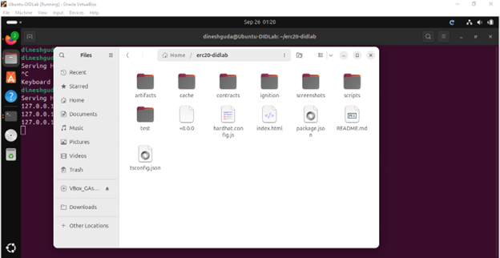
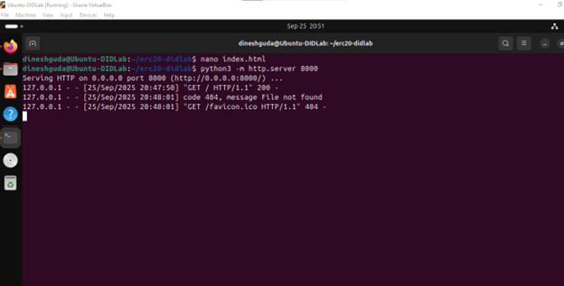
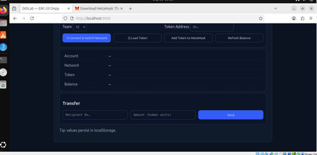
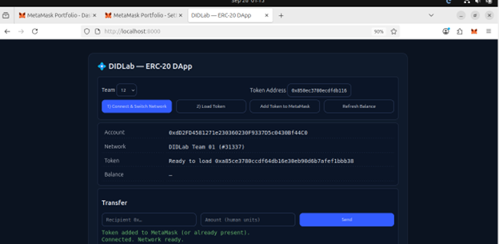
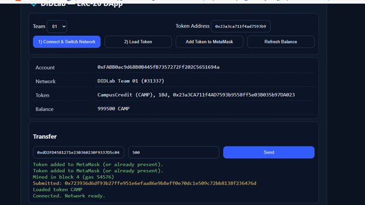

# Activity 4 — Build a Tiny DApp UI for ERC-20 on DIDLab

## 1. Project Setup

I started by creating a new folder called `erc20-didlab`. Inside it, I added the `index.html` file which contains all the code for the DApp. This file is responsible for the UI and logic that connects MetaMask, switches to the DIDLab test network, and interacts with my ERC-20 token.

Here’s a look at the folder structure with the `index.html` file:  


---

## 2. Running the Local Server

Once the file was ready, I needed to serve it locally. For that, I used Python’s built-in HTTP server with the following command:

```bash
python3 -m http.server 8000
```

This successfully started a server at `http://localhost:8000`. You can see the server running in my terminal here:  


---

## 3. Connecting to MetaMask

With the server running, I opened the DApp in my browser. The first step was to click **Connect & Switch Network**, which triggered MetaMask to ask for permission to connect to the DIDLab network.  

Here’s the interface showing the connection prompt:  


---

## 4. Loading the Token

After connecting my account, I pasted the token address into the DApp and clicked **Load Token**. MetaMask popped up again asking for confirmation. Once approved, the DApp displayed the token’s details (name, symbol, and decimals).  

Here’s the screenshot of that step:  


---

## 5. Viewing Balance

The final step was checking my token balance. After the token was loaded, the DApp displayed my account address, the DIDLab network ID, the token contract address, and my current balance.  

Here’s how it looked in the browser:  


---

## Troubleshooting Notes

Along the way, I noted a few common issues that might come up:

- If nothing happens on connect, make sure MetaMask is installed and enabled.  
- If the network is wrong, you’ll need to approve the DIDLab network switch prompt.  
- If you get `Returned no data (0x)`, the token address might be wrong or not deployed on that chain.  
- If you see `Insufficient funds`, import the faucet private key or send tokens to your account.  

---

## Conclusion

By the end of this activity, I had a fully working minimal DApp UI. It can:

- Connect with MetaMask  
- Switch to the correct DIDLab test network  
- Load and display ERC-20 token details  
- Show my token balance  
- Provide functionality to transfer tokens and add them into MetaMask  

This exercise really helped me understand how a simple single-file DApp can interact with a blockchain and wallet extension in a practical way.


---

## 6. Loading the Token (Custom Token CAMP)
After connecting my wallet, I loaded my deployed ERC-20 token **CampusCredit (CAMP)**.  
The DApp displayed the token’s details (name, symbol, decimals) and my initial balance of 1,000,000 CAMP.


---

## 7. Token Transfer
Next, I tested the transfer function by sending **500 CAMP** to another account.  
The transaction was mined in block 4, and my balance updated to 999,500 CAMP.


